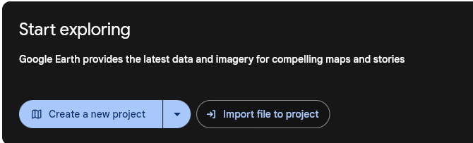
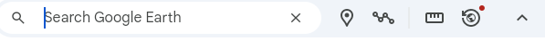

# Google Earth Narrative Maps 
Google Earth is a multiplatform and web program that uses aerial photography, superimposed images, and GIS data to create a 3D representation of the earth.  Users can enter addresses and geographical coordinates to view areas at various ages. In 2019, Google added creativity options that would allow individuals to tell their own stories using 3D street views, aerial footage, placemarks, routes, shapes, and descriptive text. Here is an example:
- The neighbourhood in Brazil where a DSC staff member and his family lived for four months [here](https://bit.ly/3bFS5Rt){:target="_blank"} 

1. **Creating Your Google Earth Project**: Go to [Google Earth](https://earth.google.com/web/){:target="_blank"}
2. Click on the light blue **Create a New Project** button at the top of the page. 
Note: If you aren't already, there will be a prompt for you to sign into a Google Account once you click **Create a New Project**. If you need to create a Google account go [here](https://accounts.google.com/){:target="_blank"} 

<button onclick="toggle('gif1')">Show/Hide Animation</button>

        
     
 

3. **Adding to Your Google Earth Project** 
- Once you have done this, you can add your first location, route, or slide by clicking on the **search bar**. 
4. **Location**
- To add a location, click on **Search to add place** and type in the location’s name.  A red marker will appear at your chosen location 
- You can choose to add this to your project by clicking on **Add to project** (located beneath the area description at the right ).

<button onclick="toggle('gif2')">Show/Hide Animation</button>

        
     
 

- Alternatively, you can click **Add placemark**, click on a place on 
- the map and then click **Add to project** 

<button onclick="toggle('gif3')">Show/Hide Animation</button>

        
     
 

- If you would like to add a title, description, photo, or link click on the pencil icon **Edit feature**. 
- To add a photo or video, click on the top box that has a camera icon.  
- For photos, there are several options for uploading: computer file, google images, google drive, or using a URL. You can add as many photos and/or videos as you’d like! 

<button onclick="toggle('gif4')">Show/Hide Animation</button>

        
     
 

5. **Location View**
- To change the view that appears when a location on your map is clicked on, hover your mouse over your chosen location and click on the pencil icon **Edit feature**. Google Earth will move to this location and show you an aerial view.

<button onclick="toggle('gif5')">Show/Hide Animation</button>

        
     
 

- To change from 2D to 3D go to the bottom right corner and click on the button 
- To move the physical location, click, hold, and drag your mouse to move the map around.  
- For adjusting the tilt (angle your view is at) and heading (place your view is facing), hold SHIFT while clicking, holding, and dragging the mouse vertically or horizontally, respectively.
- You can also adjust the altitude by using the mouse wheel.
- Use **-,+** at the bottom right corner to zoom in and out
- Once you’ve got your desired view, click on **Capture this view**.  Now when you click on your marked location in your map, you will be brought to this view!

<button onclick="toggle('gif6')">Show/Hide Animation</button>

        
     
 

- To get a Street View, go to the bottom right corner and click on the little person icon. 
- Next, click on the location on your map in which you would like to set your view from.  Note: you will be limited to the areas that are highlighted in light blue.
- Once you have clicked on this location, Google Earth will zoom in and switch to a real-image 3D view of it. 

<button onclick="toggle('gif7')">Show/Hide Animation</button>

        
     
 

- To change the view, repeat the steps for the 2D example (Note: no need to use SHIFT to rotate and tilt; the mouse does everything) 
- Alternatively, using the search bar in the left column, you can search a specific place that is in your area and use that (in the example at the right, Bruce Hall is a centre in Channel-Port Aux Basques, NL that Terry Fox made a speech at during his Marathon of Hope) and click **Add to project**, giving it the name of the overall location (e.g. Channel-Port Aux Basques)
- Once you’re happy with your view, click on **Capture this view** which will then prompt you to save the location.) 

<button onclick="toggle('gif8')">Show/Hide Animation</button>

        
     
 

6. Route 
- Selecting the **Draw line or shape** will allow you to create a route. To do this, click on your desired starting location and move your mouse to your next location.  When you reach this next location, click again and continue to make as many points as you’d like!  To complete the path, press **ENTER** when you’re at your final point. You have now made a route! 

<button onclick="toggle('gif9')">Show/Hide Animation</button>

        
     
 

- d.) Slide 
- Here you can add a full screen slide with text, a background (image or colour)

[NEXT STEP: Google Sheets Bar, Pie and Bubble Charts](google-sheets-charts.html){: .btn .btn-blue }
