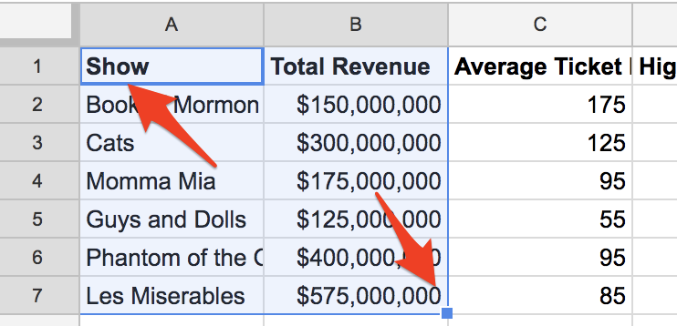
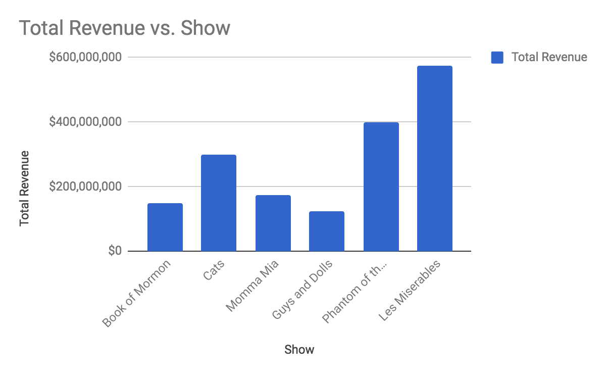
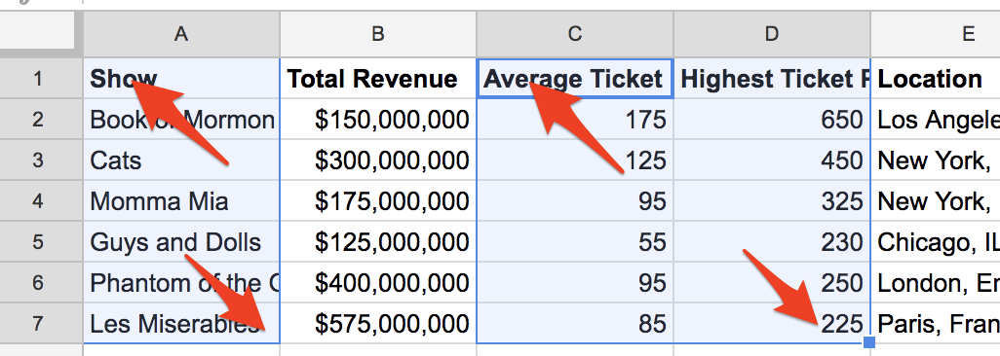
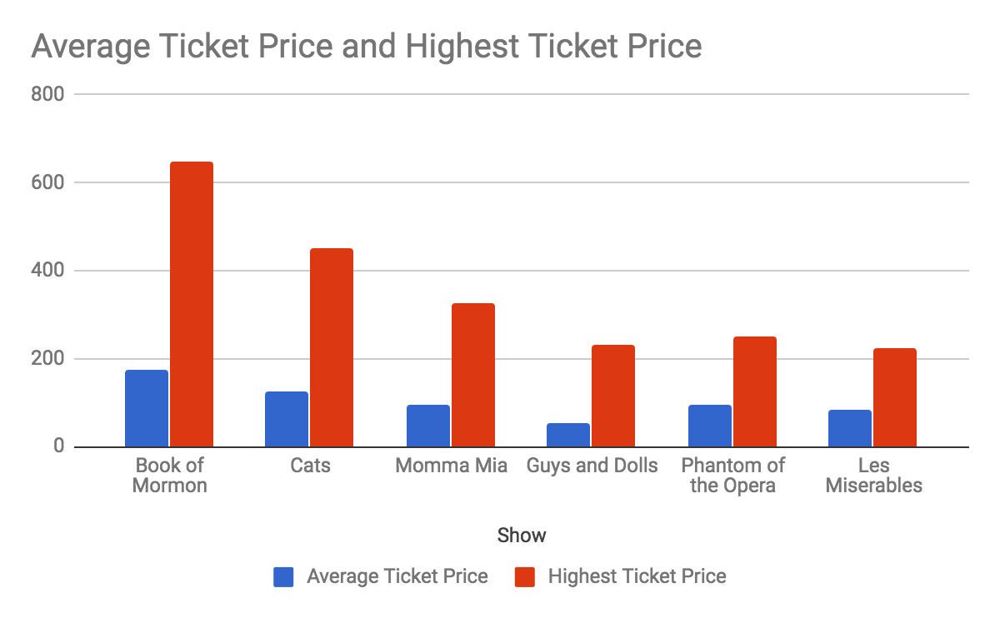
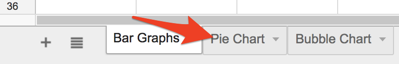
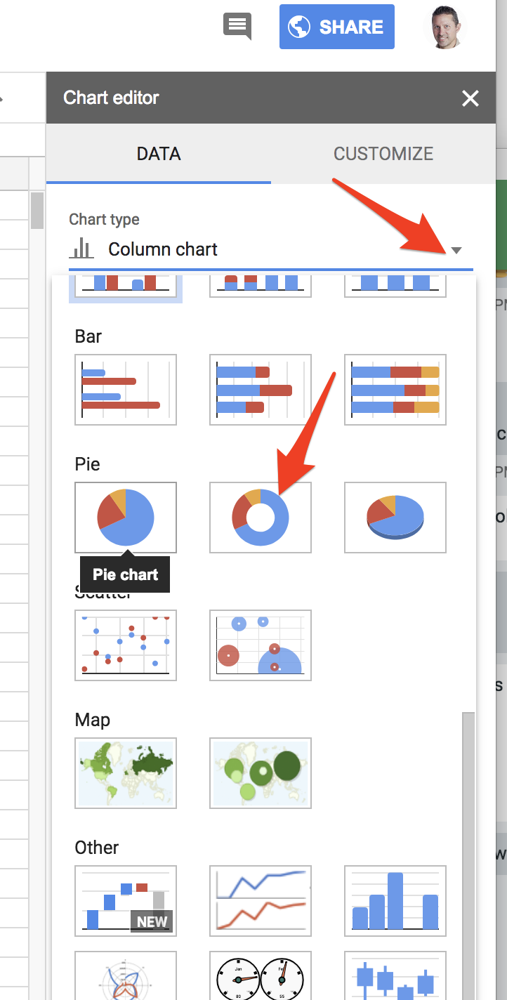
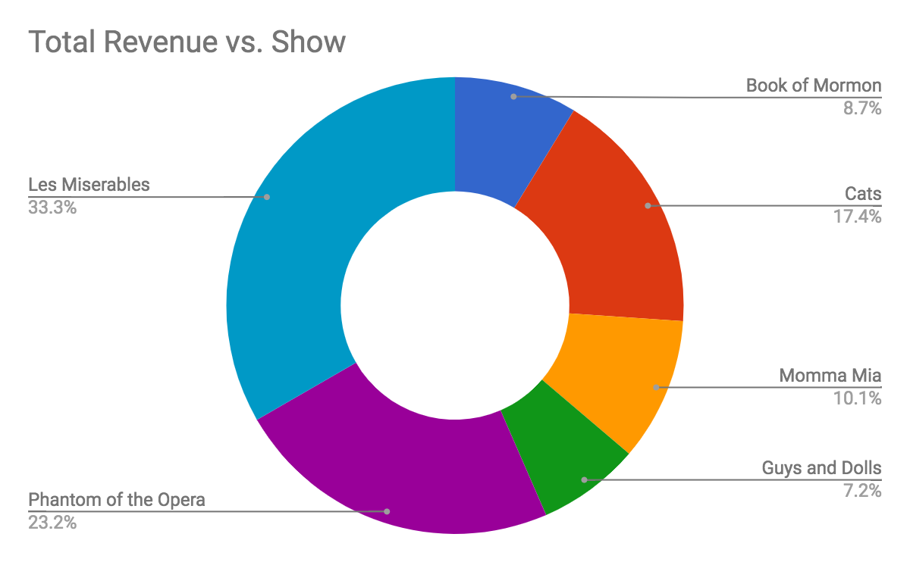
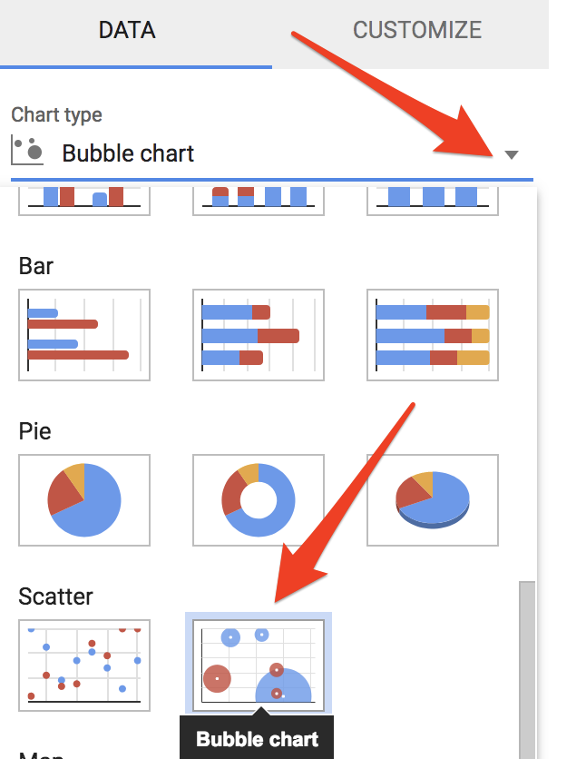
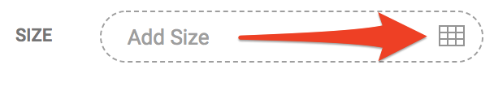
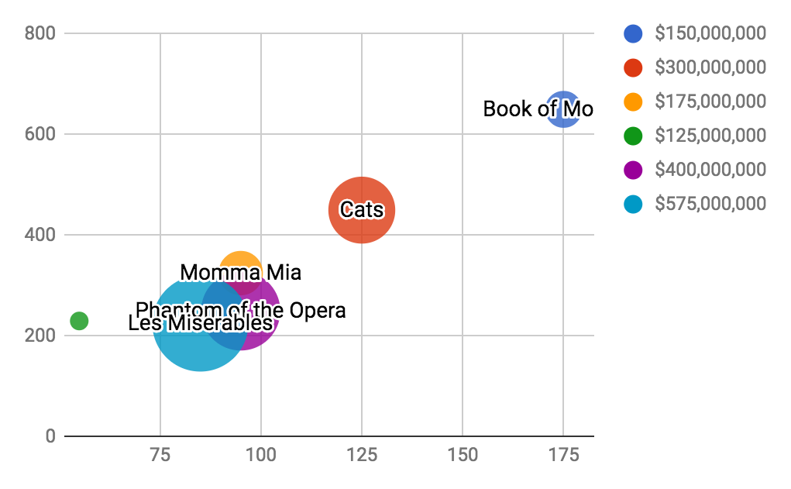

# Google Sheets Bar, Pie and Bubble Charts
In this exercise, you will create visualizations ranging from a pie chart to a bubble chart. Don’t worry if the names of the different charts aren’t familiar to you, you should have a basic understanding of how they work by the end of this workshop. If you have any questions or get stuck as you work through this, please ask your instructor for assistance. 

1. Open [Google Drive](https://drive.google.com/){:target="_blank"} and make sure that you are logged in.
- Open [this Google Sheet](http://bit.ly/2JnNeLr){:target="_blank"} that is populated with data for you to create your visualizations 
- Make a copy of the spreadsheet, by clicking on the menu **File -> Make a copy**

2. **Bar Graph with one column of data:**
- Start by selecting the top-left cell of the spreadsheet with “**Show**” in it, and then drag and let go once you’ve reached the “**$575,000,000**” cell to the bottom right.
- Next click on the “**Insert**” menu, and then, “**Chart**”. 
- Congratulations, you have created a bar graph chart showing revenue for several famous Broadway plays!
- Note that if you want to modify your chart, on the right hand of the spreadsheet there is a “**Chart editor**” toolbar. Most of the interesting settings are under the “**Customize**” tab.

3. **Bar Graph with two columns of data**: 
- Stay on the same spreadsheet and select the top-left cell of the spreadsheet with “**Show**” in it, and then drag to the bottom cell of column “**A**” with “**Les Miserables**”. On a Mac, hold down the “**command**” button (on a PC hold down the “Ctrl” button) and then select “**Average Ticket**”,  and then drag to the bottom of column “**D**” with “**225**” in the cell.
- Next click on the “**Insert**” menu, and then, “**Chart**”. 
- Congratulations, you have created a bar graph chart showing the average ticket price, compared to the highest ticket price for each play!

4. Pie Chart: 
- At the very bottom of the Google Sheet, click on the “Pie Chart” tab.
- Start by selecting the top-left cell of the spreadsheet with “**Show**” in it, and then drag and let go once you’ve reached the “**$575,000,000**” cell to the bottom right (exactly like you did in step #2 on the previous page).
- Next click on the “**Insert**” menu, and then, “**Chart**”. 
- Now let’s change this bar chart into a nice looking Pie Chart. Look on the right navigation bar that just appeared, and click on the little triangle to the right of the “Column chart” and then select the pie chart with the hole in the middle. 
- To change the title of the chart, double click on the title in the chart, “**Total Revenue vs. Show**”, and change the title to something more descriptive like, “Broadway Play Revenue Percentage”.
- Congratulations, you’ve created a beautiful doughnut pie chart! 

5. **Bubble chart**: 
- At the very bottom of the Google Sheet, click on the “**Bubble Chart**” tab.
- Start by selecting the top-left cell of the spreadsheet with “**Show**” in it, and then drag and let go once you’ve reached the “**$575,000,000**” cell to the bottom right (exactly like you did in step #2 on the previous page).
- Next click on the “**Insert**” menu, and then, “**Chart**”. 
- Now let’s change this bar chart into a nice looking Bubble Chart. Look on the right navigation bar that just appeared, and click on the little triangle to the right of “**Column chart**” and then select the bubble chart.
- You should have a nice bubble chart now. Let’s modify it so that the size of bubbles represents the relative amount to total revenue.  On the far right, navigation select the grid icon beside “**Size**” 
- 
- A Dialog box should appear asking for “What data?”  Enter “**D1:D7**”. 
- Your bubbles should now be scaled to the relative revenue of the play.
- Congratulations on creating a beautiful bubble chart! 
 
Great job!

[NEXT STEP: Earn A Workshop Badge](informal-credentials.html){: .btn .btn-blue }  
[Coming Soon: Storymap JS Narrative Gigapixel Maps](storymap-gigapixel-map.html){: .btn .btn-blue }
