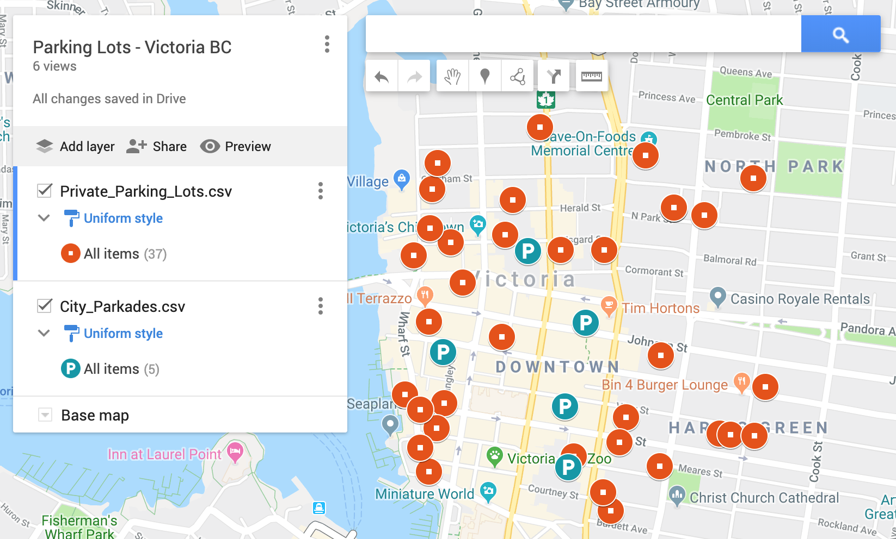
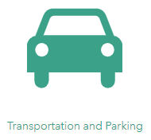
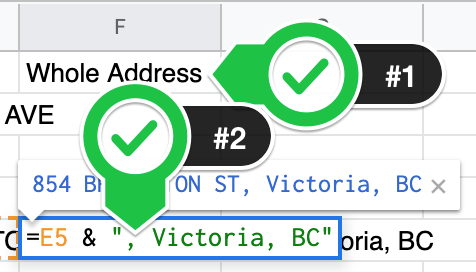
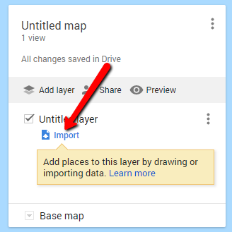
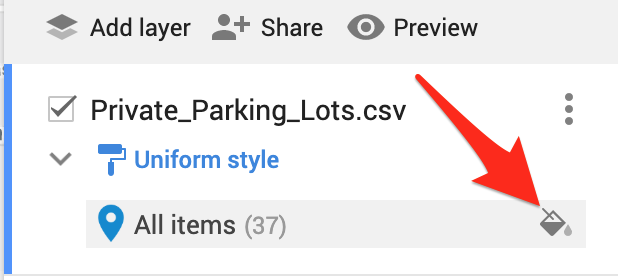
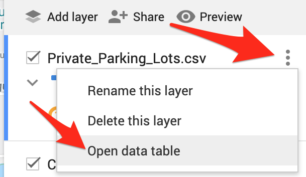

# Mapping Data with Google Sheets & Google My Maps
In this exercise, you will create visualizations map region and maker visualizations using Google Sheets and Open Data from the city of Victoria BC. If you have any questions or get stuck as you work through this, please ask your instructor for assistance. 

1. Open [**Google Drive**](https://drive.google.com/){:target="_blank"} and make sure that you are logged in.

2. Open a new tab in your web browser, and then open the [**City of Victoria’s open data repository** website](http://opendata.victoria.ca){:target="_blank"}
- Scroll down the web page and click on: **Transportation and Parking**
- Next, scroll down the web page and find the **Private Parking Lots** button, and click on it.
- Click on the green **Data** tab.
- Click on the **Download** button to the right, and then select Spreadsheet. (use this link if you have problems finding the [file](http://bit.ly/31wBewm){:target="_blank"}). Save the Private_Parking_lots.csv file in a location where you will be able to find it.
- Open your **Google Drive** tab in your web browser.

- Click on the **New** button on the top left, and then select **File upload**.
- In the file browser, find the **Private_Parking_lots.csv** file that you just downloaded, and then select it and click **Open** to upload it to your Google Drive. 
- Open this sheet in Google Drive so you can see what the data looks like.

3. **Add Latitude and Longitude to the spreadsheet**:
- We now need to give the spreadsheet a bit more information to Geolocate the data:
      - In Google Docs go to the **Add-ons** menu, and then select **Get add-ons**… 
      - Search for **Geocodes** and then press the **+ Free** button to the right of **Geocode by Awesome Table**. It will ask what Google account you want to use, and for permission to modify your Google Sheets. For it to work, you need to give it these permissions.

- To Geocode, start by typing in **Whole Address** in cell **F1** in the spreadsheet.
- Next in cell **F2** below type: **=e2 & “Victoria, BC”** then press enter.
- Now click on cell **F2**, and then click on the blue dot in the corner of the cell and drag it down to cell **F38** and then let go. This should populate cells F2 to F38 with the street addresses magically followed by “, Victoria, BC”. 
- Now go to the **Add-ons** menu, select **Geocode by Awesome Table**, and press **Start Geocoding**.
- A sidebar will appear to the right of the spreadsheet. Make sure that the dropdown under **Address column** says **Whole Address**.
- Press the blue **Geocode**! button at the bottom of the sidebar. The latitude and longitude should appear in two new columns to the right of the Whole Address column. This may take one or two minutes.

4. **Create a new My Google Map & Import City parkade data**:
- In a new tab in your browser, open [Google My Maps](https://google.com/mymaps){:target="_blank"} 
- Click on the red **Create a New Map** button.

- Click on the blue, **Import** link on the left side of the page.
- Select the white **Google Drive** Tab, and then click on **Recent**. 
- Click on the **Private_Parking_lots.csv** file and click **Select**. 
- A dialogue box will appear. Make sure the **Latitude** and **Longitude** checkboxes are selected, and then press the blue **Continue** button.
- The next dialogue box will ask you to select a title for your markers. Select **Whole Address**, and then press the blue **Finish** button. 
- In a few seconds, your map will populate with blue markers indicating the location of all the private parking lots in the city of Victoria. Note that when you click on a blue marker a dialogue box will pop up giving you additional information from the spreadsheet.

5. **Marker Formatting options:** Let’s change the colour and shape of the markers.

- On the left side menu, click on the little **grey paint bucket** to the right of the **All items** menu (see image to right).
- A popup menu will appear. Select your favourite colour for the icon, and change the icon into a different shape.

6. **Editing the underlying data in Google My Maps**. You can always make changes in your Google Sheet and re-import the data, however for small changes it is usually quicker to make minor changes in Google My Maps.

- Start by clicking on the **three grey dots** to the right of Private_Parking_lots.csv, then select **Open data table**.
- Double click on any cells you want to edit. When you’re finished editing click the **x** in the top right of the table.
- You can also edit by clicking on the icon for a parking lot and then press the pencil button on the bottom row of the card.

7. **Sharing options**:

- To share this map publicly on the web, or with individual people, click on the grey **Share** button in the left navigation menu. To make the map public, click on the blue **Change**… button, and then select **On - Public on the web**. Click Save.
- To share with individuals enter the email addresses of the people you want to share with and then press **Send** and then **Done**.
- To embed in a website, click on the 3 grey dots to the right of the map name (see above). Next Select **Embed on my site** and copy and paste the HTML code into a public web page.

8. **Extra Credit**: Add another layer to your map - City of Victoria parkades:
- Download the [private parkade data](http://bit.ly/2MVGNRX){:target="_blank"}  and then save it to a place where you can find it on your computer.
- Open your **Google Drive** tab in your web browser.

- Click on the **New** button on the top left, and then select **File upload**.
- In the file browser, find the **City_Parkades.csv** file that you just downloaded, and then select it and click **Open** to upload it to your Google Drive. 
- Use the instructions in section #3 & #4 to geocode new data and import it into Google Maps. 
    - Except in step #3 ignore setting up the GeoCoding Add-on.
    - In step #4 instead of creating a new Google My Map you’ll click on the grey, **Add Layer** button and import the Google Sheets data into the new layer you created. Great job!

[NEXT STEP: Narrative Maps with StoryMap JS](narrative-storymap.html){: .btn .btn-blue }
