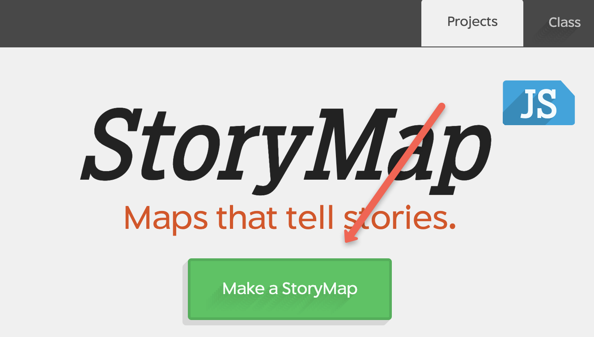
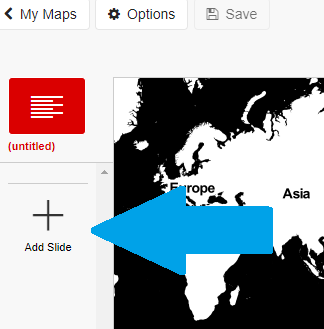
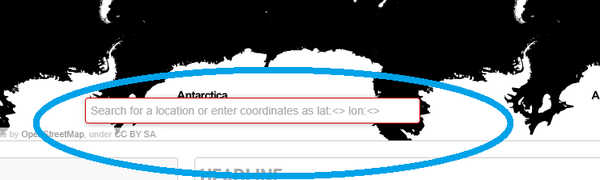
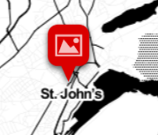
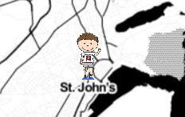
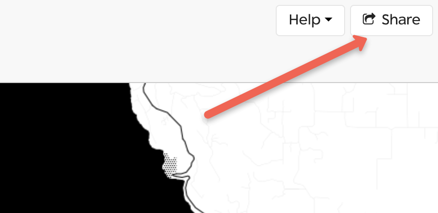
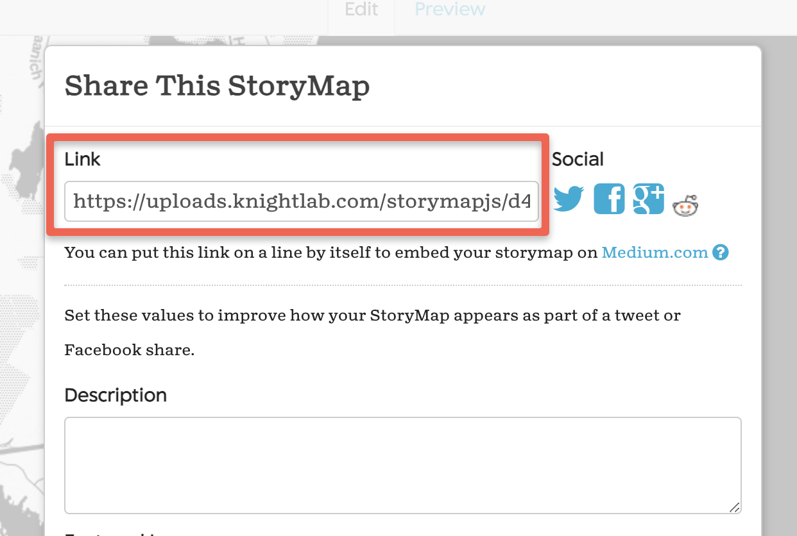

# Narrative Maps with StoryMap JS
StoryMap JS is a web-based tool for creating narrative maps. You can use traditional cartographical maps (such as road maps) using the regular StoryMap format. You can also use images of historical maps or any other images using the Gigapixel Map feature. The instructions below take you through the process of creating a StoryMap. Here is an excellent example of how a UVic graduate student used StoryMap to tell the story of Emily Eden's Travels in India from 1836-1842 based on Emily's journals and paintings. You can see the StoryMap [embedded into a WordPress website](https://chadley.opened.ca/emily-edens-journey-map/){:target="_blank"}, as well as [on it's own web page](https://uploads.knightlab.com/storymapjs/42fdf535b76588f3a3e594ff6f030bd1/emily-eden/draft.html#?secret=wmqKaOYCdV){:target="_blank"} (which most people find much easier use).

1. Go to [StoryMap](https://storymap.knightlab.com/){:target="_blank"} and click the green Make a StoryMap button.

2. Sign in with your Google account. If you need to create one go [here](https://accounts.google.com/){:target="_blank"} 

3. Click the green **New** button, then enter a title for your StoryMap. Click the green **Create** button.  

4. To add your first location, click on **Add Slide** in the far left column.

5. Once you have done this, a red box will appear on the map, prompting you to add your first location.  You can enter either the name of a location e.g. “St. John’s Newfoundland” or its latitude/longitude coordinates in the following format: **lat:<123.31°W>, lon:<48.46°N>** 
Note: To get the degree symbol use Alt+0 for Mac and Ctrl+0176 (make sure number lock is on!) for Windows.

6. To add a heading and description of your slide, use the text boxes at the bottom. 

7.  To change the background for your slide or change your location marker icon, click on **Background Options** or **Marker Options** at the very bottom of the screen.  
      - Background Colour: Use the colour wheel to adjust the background colour 
      - Image: To add an image from your computer click **Choose File**.  Alternatively, paste a URL link to an online photo. Right-click on the desired photo and select **Copy Image Address**, and then paste into the text box beneath **Background image**. 

8. To review your changes, click **Preview** at the top of the page. 

9. To continue making your “journey”, repeat steps 5-8 for each place you would like to highlight and stop at. Bed sure to save your work frequently!

10. Linking to your Story: to create a link to your StoryMap to share with others, click on the grey **Share** button on the top right of the web page.

11. Copy the URL in the Link box and then share the link with others!

12. Congratulations on creating your first StoryMap!

[NEXT STEP: TimeLine JS](timeline-js.html){: .btn .btn-blue }
