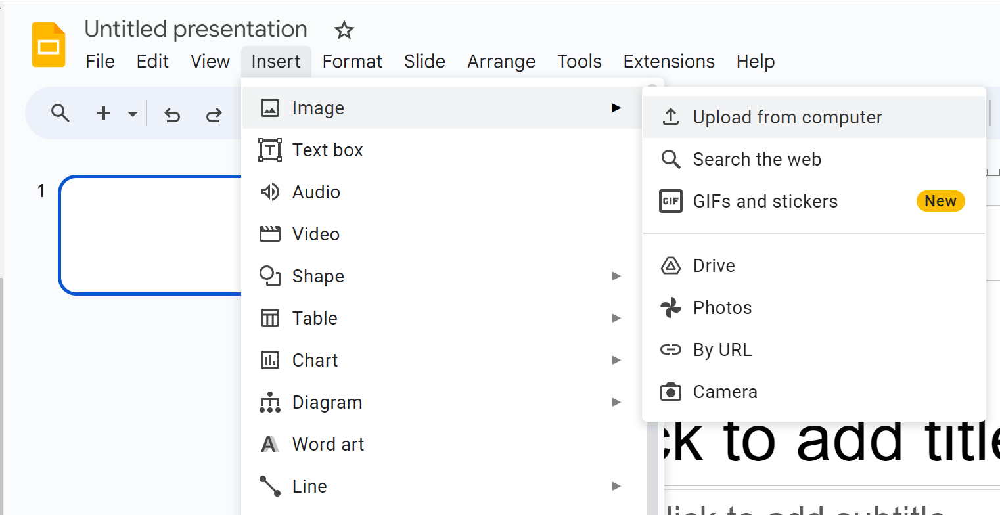

# Processing Images for Juxtapose JS

Juxtapose JS is a free, open source, web-based tool that lets you compare two media objects either images or gifs. For the best results, the two images should have points of visual similarity. A comparison of the same building at different points of time work well, for example, or a comparison of a painting before and after restoration. 

This worksheet outlines how to edit two image files in Google Sheets so they can be used most effectively in Juxtapose. The example can be viewed [here](https://goo.gl/54Ww3u){:target="_blank"}

1. Find and save two images to use in the Juxtapose slider. Record the URLs and source information to use later.
2. Go to [Google Slides](https://www.google.ca/slides/about/){:target="_blank"}. Click **Go to Google Slide**s, then start a new blank presentation.
3. In the **Layout** menu, choose **Blank** to create a blank slide.   
4. To add the first image, go to the **insert** menu and choose  **Image**. then **Upload from Computer**. Browse to the first image and insert it.

5. Add the second image to the same slide. To make it easier to see how the images overlap, go to the **Format** menu and choose **Format Options**. Expand the **Adjustments** menu and set the transparency of the second image to about 50%. You should be able to see the first image through the second image.
6. Line up the images as much as possible, using one point as an achor. In this example, the images are of the same building but taken from different angles. The first image was enlarged so the building matched the size of the second building, and the images are lined up at the roofline.
7. Crop images so that they are both the same size by double-clicking each image in turn and dragging the "crop" handles so that they are both the same size.
8. Add a new blank slide, thne copy and paste the second image onto it. Return its transparency to 0%.
9. Download both images as jpg or png files. Go to **File** then **Download as**, then choose the desired format. You'll need to do this twice, once for each photo.
10. Using an image editor, such as Paint 3D on a PC or Preview on a Mac, crop both images to remove the white background.
11. Finally, uload the two images to the web, Dropbox, or to Google Photos. You will need a URL for each image to create the Juxtapose slider.
12. To create a Juxtapose slider, follow the instructions on the activity sheet called **Introduction to Comparison Visualizations with Juxtapose JS**.

Congratulations on processing your first images to use in Juxtapose JS!

Here is just [an example](https://onlineacademiccommunity.uvic.ca/dsc/2018/03/05/visualizing-mr-darcy-with-juxtapose-js/){:target="_blank"}

[NEXT STEP: Introduction to Comparison Visualizations with Juxtapose](comparison.html){: .btn .btn-blue }
