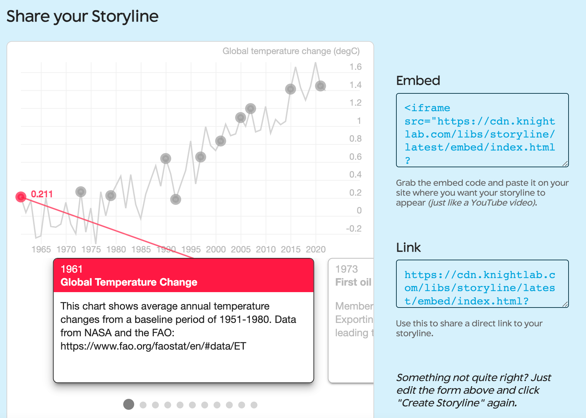

# Narrative Maps with StoryLine JS

In this hands-on activity, you will generate a storyline such as the one below, which shows historic changes in temperature as well as climate change milestones.

<iframe src="https://cdn.knightlab.com/libs/storyline/latest/embed/index.html?dataURL=https%3A%2F%2Fdocs.google.com%2Fspreadsheets%2Fd%2Fe%2F2PACX-1vRZ83SC8r8FGkB4EX_8DST4G6T1tY2p6wvIfll-X0iLG2wUuaz4ESVvZ-fXD5-BWuXv88m5E4TmqzHX%2Fpubhtml&amp;dataYCol=value&amp;dataXCol=year&amp;dataDateFormat=%25Y&amp;chartDateFormat=%25Y&amp;chartYLabel=Global%20temperature%20change%20(degC)&amp;sliderCardTitleCol=captiontitle&amp;sliderCardTextCol=captiontext" style="width:100%;height:650px;" frameborder="0" marginwidth="0" marginheight="0" vspace="0" hspace="0"></iframe>

Caption sources:
[American Institue of Physics](https://history.aip.org/climate/timeline.htm)
[Brittanica](https://cdn.britannica.com/92/192592-050-6A70F97C/Timeline-developments-climate-change-1896-2016-Paris-Agreement.jpg)

1. Go to the [UN FAO database](https://www.fao.org/faostat/en/#data/ET) and enter the following parameters (as shown in the picture below):
-	In the top left box, select Regions and then select World + (Total). This will create average global temperature change values in the y-axis of your storyline.
-	In the top right box, select Temperature Change. This will generate temperature change data from a baseline of 1951-1980.
-	In the bottom left, select Meteorological year. This will create intervals of years in the x-axis.

2. Download data as a csv file. Then, either paste the values from excel into [Google Sheets](https://docs.google.com/spreadsheets/create){:target="_blank"} OR open a blank google sheet, click File > Import > Upload and select your downloaded file.

3. In this exercise, we will only need to use the Year and Value columns. Keep those columns and delete the remaining columns. Then, add two additional columns entitled Caption Title and Caption Text. These columns contain the title and descriptions, respectively, of cards that will be attached to points in time that you want to highlight.

4. To complete your Caption Title and Caption Text columns, find and enter relevant climate change milestones from sources such as:
[Britannica’s Timeline of Climate Change](https://cdn.britannica.com/92/192592-050-6A70F97C/Timeline-developments-climate-change-1896-2016-Paris-Agreement.jpg){:target="_blank"}
[The American Institute of Physics Timeline of Global Warming](https://history.aip.org/climate/timeline.htm){:target="_blank"}

Here is an example of Caption titles and text entered in the spreadsheet:

5. Once you have finished entering captions, click File > Share > Publish to web.

Then, copy the link provided in the window without changing any of the other settings.

6. Paste the URL into the "Configure your Storyline" box at http://storyline.knightlab.com/, then click Load. Configure the parameters provided to correspond to the column titles/format in your spreadsheet. Think of a title for your y-axis (e.g., “Global temperature change (degC)”

7. Finally, click the “Create Storyline” button below, which will generate 1) an embed code that you can paste onto your site where you want your storyline to appear and 2) a direct link to your story line.

 [NEXT STEP: Processing Images with JS](processing.html){: .btn .btn-blue }
