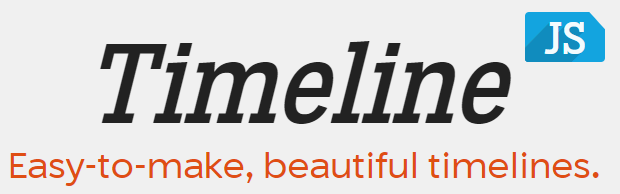
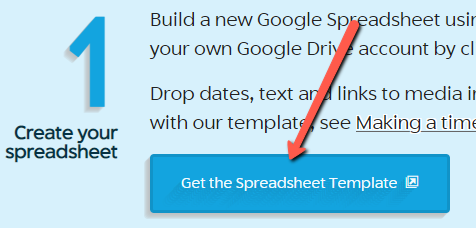
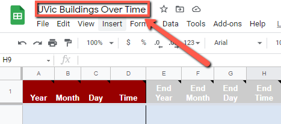
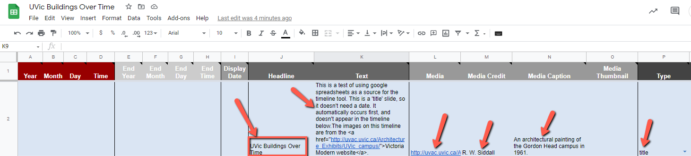

[](https://cdn.knightlab.com/libs/timeline3/latest/embed/index.html?source=1s45s1S3LH7ukGOA8fsmI8weK-rgDwRK6i-TMPe6rhcM&font=Default&lang=en&initial_zoom=2&height=800){:target="_blank"}
# TimeLine JS

TimeLine JS is a free web-based tool for creating narrative timelines. Timelines can include media like photos, and are created using Google Sheets. The instructions below take you through the process of creating a TimeLine. Take a look at this sample TimeLine JS project which is a [timeline of building construction on campus at UVic](https://bit.ly/2W5LvBO){:target="_blank"}.

1. Go to the [Make a TimeLine JS](https://timeline.knightlab.com/){:target="_blank"} and click on the **Make a Timeline** button.

2. Determine what topic you will use for your timeline, keeping in mind that you will need easy access to images and dates for your topic.
- We encourage you to create a timeline of a topic of interest to you, but if you don't have access to photos or dates relating to your topic, you can making a timeline using the provided photos of your favourite UVic buildings from the [Victoria Modern website](http://uvac.uvic.ca/Architecture_Exhibits/UVic_campus/){:target="_blank"}. 
- The examples in the rest of this activity will use images and dates from the Victoria Modern website.

3. Your Timeline will be built from the data you enter into a pre-formatted Google Spreadsheet. To create a spreadsheet, copy the template provided for you by clicking on the **Get the Spreaqdsheet Template** button. 

4. If prompted, sign into your Google account. If you need a Google account, make one at [accounts.google.com](https://accounts.google.com){:target="_blank"}. 
- Click **Make a Copy** when prompted.

5. Change the title of the spreadsheet to match your project. If you are using the provided imaages and dates, you might want to name your spreadsheet, <code>UVic Buildings Over Time</code>.


6. In the Google Spreadhseet, create a title slide by doing the following:
- Enter a headline for your timeline in cell **J2** (see below). For example: <code>UVic Buildings Over Time</code>.
- Next add some text giveing more details about your time line in cell **K2** (see below). For example: 
```
This is a 'title' slide, so it doesn't need a date. It automatically occurs first, and doesn't appear in the timeline below.The images on this timeline are from the <a href="http://uvac.uvic.ca/Architecture_Exhibits/UVic_campus/">Victoria Modern website</a>.
```
- Add an image to the title page by copying and pasting a URL into field **L2**: For example copy the following image URL into **L2**: <code>http://uvac.uvic.ca/Architecture_Exhibits/UVic_campus/buildings/Gordon_Head_Campus/images/large/Projected-Plan-Rev1961-b.jpg</code>
- Add the media credit to field **M2**. For example: <code>R. W. Siddall</code>.
- Add the media description to field **N2**. For example: <code>An architectural painting of the Gordon Head campus in 1961.</code>.
- Make sure that in **column P**, **title** is selected from the drop down menu (see below).<br>
[](images/timeline-title-slide.png){:target="_blank"} (Click to enlarge photo)<br>

7. Enter the first building data into your spreadsheet:
- Next step here...

8. Under Development!<br>

[NEXT STEP: Google Earth Narrative Maps](google-narrative-maps.html){: .btn .btn-blue }
