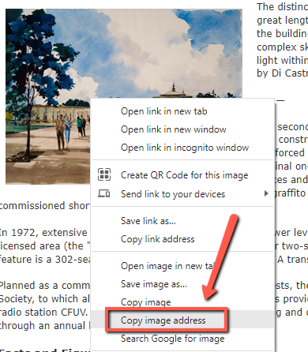
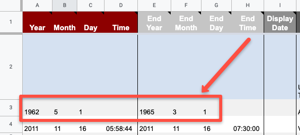
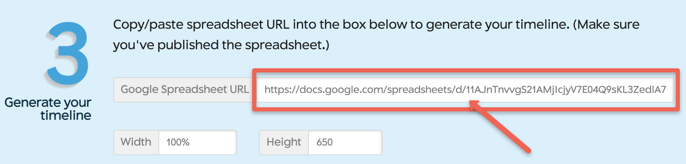
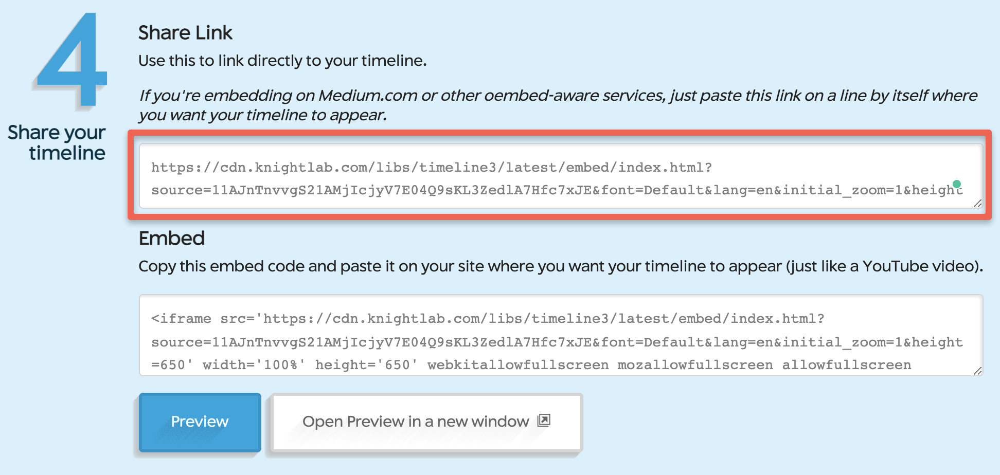

[](https://cdn.knightlab.com/libs/timeline3/latest/embed/index.html?source=1s45s1S3LH7ukGOA8fsmI8weK-rgDwRK6i-TMPe6rhcM&font=Default&lang=en&initial_zoom=2&height=800){:target="_blank"}
# TimeLine JS

TimeLine JS is a free web-based tool for creating narrative timelines. Timelines can include media like photos, and are created using Google Sheets. The instructions below take you through the process of creating a TimeLine. Take a look at this sample TimeLine JS project which is a [timeline of building construction on campus at UVic](https://cdn.knightlab.com/libs/timeline3/latest/embed/index.html?source=1s45s1S3LH7ukGOA8fsmI8weK-rgDwRK6i-TMPe6rhcM&font=Default&lang=en&initial_zoom=2&height=650){:target="_blank"}.

1. Go to the [Make a TimeLine JS](https://timeline.knightlab.com/){:target="_blank"} and click on the **Make a Timeline** button.

2. Determine what topic you will use for your timeline, keeping in mind that you will need easy access to images and dates for your topic.
- We encourage you to create a timeline of a topic of interest to you, but if you don't have access to photos or dates relating to your topic, you can making a timeline using the provided photos of your favourite UVic buildings from the [Victoria Modern website](http://uvac.uvic.ca/Architecture_Exhibits/UVic_campus/){:target="_blank"}. 
- The examples in the rest of this activity will use images and dates from the Victoria Modern website, but as mentioned, please feel free to use your own photos and related data.

3. Your Timeline will be built from the data you enter into a pre-formatted Google Spreadsheet. To create a spreadsheet, copy the template provided for you by clicking on the blue **Get the Spreaqdsheet Template** button (see right). 

4. If prompted, sign into your Google account. If you need a Google account, make one at [accounts.google.com](https://accounts.google.com){:target="_blank"}. 
- Click **Make a Copy** when prompted.

5. Change the title of the spreadsheet to match your project. If you are using the provided imaages and dates, you might want to name your spreadsheet, <code>UVic Buildings Over Time</code>.


6. In the Google Spreadhseet, create a title slide by doing the following:
- Enter a headline for your timeline in cell **J2** (see below). For example: <code>UVic Buildings Over Time</code>.
- Next add some text giveing more details about your time line in cell **K2** (see below). For example: 
```
This is a 'title' slide, so it doesn't need a date. It automatically occurs first, and doesn't appear in the timeline below.The images on this timeline are from the <a href="http://uvac.uvic.ca/Architecture_Exhibits/UVic_campus/">Victoria Modern website</a>.
```
- Add an image to the title page by copying and pasting a URL into field **L2** (see below): For example copy the following image URL into **L2**:<br> <code>http://uvac.uvic.ca/Architecture_Exhibits/UVic_campus/buildings/Gordon_Head_Campus/images/large/Projected-Plan-Rev1961-b.jpg</code>
- Add the media credit to field **M2** (see below). For example:<br> <code>R. W. Siddall</code>.
- Add the media description to field **N2** (see below). For example:<br> <code>An architectural painting of the Gordon Head campus in 1961.</code>
- Make sure that in **column P**, **title** is selected from the drop down menu (see below).<br>
[](images/timeline-title-slide.png){:target="_blank"} (Click to enlarge photo)<br>

7. Now you will enter the data for the first timeline item into your spreadsheet (Student Union Building):
- Find a picture of the first item for your timeline. For example if you wanted to use the UVic Student Union Building for the first item on your timeline, [open this web page](https://uvac.uvic.ca/Architecture_Exhibits/UVic_campus/buildings/SUB/){:target="_blank"}.
- If you are using the Chrome web browser, **right mouse click** on the photo you would like to use, and then select **Copy image address**. 
  - In Firefox you would **Copy Image Location**. 
  - In Microsft Edge browser select, **Copy image link**.
- Paste the web address for the image in cell **L3** of the spreadsheet.
- The origional building was constructed between May 1962 and March 1965, so **edit the two date fields in row 3** of the spreadsheet to match the image below:

- Update **cell J3** with the building name: <code>Student Union Building</code>
- Update **cell K3** with the building with as much or as little of the description as you want by copying and pasting from the [Student Union web page](https://uvac.uvic.ca/Architecture_Exhibits/UVic_campus/buildings/SUB/){:target="_blank"}.
- Update **cell M3** with the media credit: <code>John A. Di Castri</code>
- Update **cell N3** with the media caption: <code>An architectural painting of the Student Union Building.</code>

8. Next enter the data for the second timeline item into your spreadsheet (Clearihue Building - A Wing):
- Find a picture of the second item for your timeline. For example if you wanted to use the Clearihue Building - A Wing for the second item on your timeline, [open this web page](https://uvac.uvic.ca/Architecture_Exhibits/UVic_campus/buildings/Clearihue/){:target="_blank"}.
- If you are using the Chrome web browser, **right mouse click** on the photo you would like to use, and then select **Copy image address**. 
  - In Firefox you would **Copy Image Location**. 
  - In Microsft Edge browser select, **Copy image link**.
- Paste the web address for the image in cell **L4** of the spreadsheet.
- The origional building was constructed between January 20, 1962 and January 18 1963, so **edit cell A4 to cell g4** of the spreadsheet with those dates.
- Update **cell J4** with the building name: <code>Clearihue Building - A Wing</code>
- Update **cell K4** with the building with as much or as little of the description as you want by copying and pasting from the [Clearihue Building web page](https://uvac.uvic.ca/Architecture_Exhibits/UVic_campus/buildings/Clearihue/){:target="_blank"}.
- Update **cell M4** with the media credit: <code>Wade Stockdill & Armour</code>
- Update **cell N3** with the media caption: <code>An architectural painting of the Clearihue Building.</code>

9. Next enter the data for a third timeline following the steps above for a different building on campus: Feel free to choose a building from [this web page](https://uvac.uvic.ca/Architecture_Exhibits/UVic_campus/){:target="_blank"}.

10. Publish your timeline spreadsheet:
- Under the **File** menu -> **Share** -> **Publish to the Web**.<br>

- In the next window, click the green **Publish** button. When asked, "Are you sure…?" click **OK**. Ignore the URL that appears in the center of the window. Just **close the window using the X** in the top right corner.<br>

- After you close the window, **copy the URL in your browser's address bar**. You'll use this in the next step.<br>


11. Create your timeline on the TimelineJS website:
- Open the [TimeLine JS web page](https://timeline.knightlab.com/#make){:target="_blank"}, and scroll down to Step 3 - Generate your timeline.
- Paste your Google Spreadsheet URL in the field in step 3.<br>

- Copy the URL from the **Share Link** field and open the URL in a new tab to see your timeline!<br>

- Congratulations on creating your first TimeLine! In case you're interested in seeing an xample of a more fully developed timeline here is one with [many UVic Buildings on it](https://cdn.knightlab.com/libs/timeline3/latest/embed/index.html?source=1s45s1S3LH7ukGOA8fsmI8weK-rgDwRK6i-TMPe6rhcM&font=Default&lang=en&initial_zoom=2&height=650){:target="_blank"}.

[NEXT STEP: Google Earth Narrative Maps](google-narrative-maps.html){: .btn .btn-blue }
