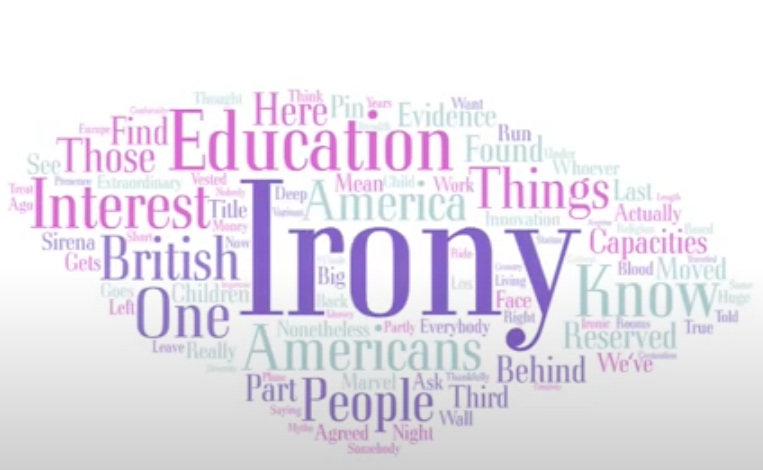
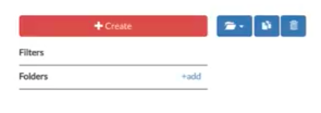
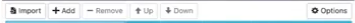
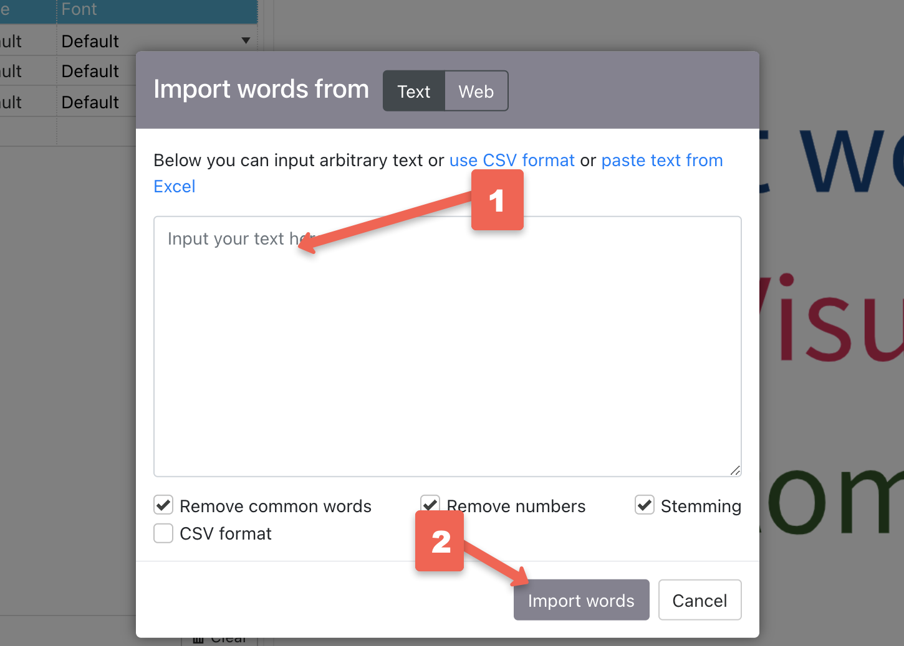
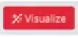
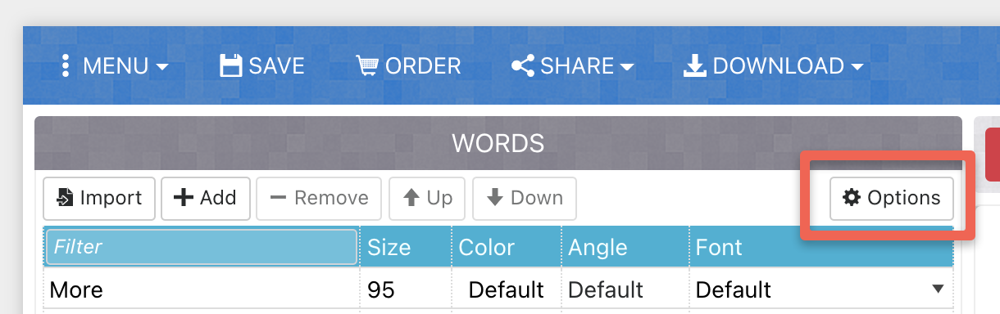
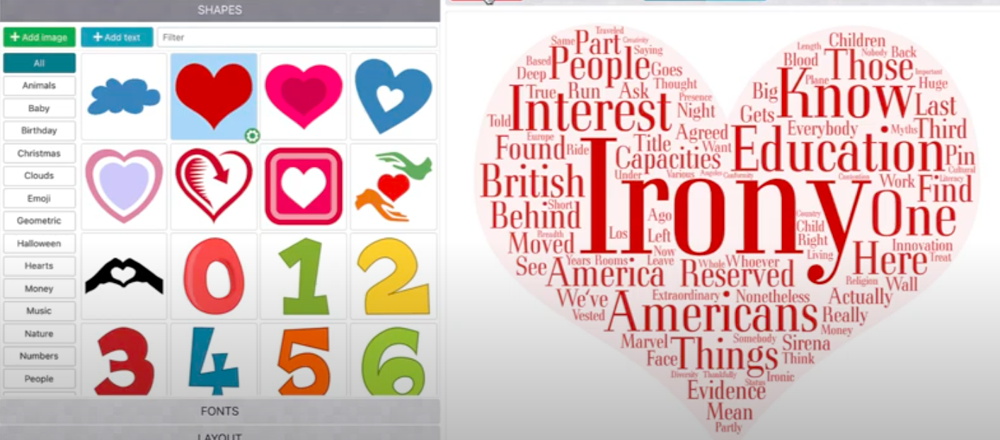
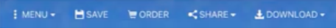

# Word Clouds with Word Art
Word clouds are data visualizations that display words in a given dataset, sized according to frequency: the more frequent a word is, the larger it is. WordArt is a free, web-based app for creating word clouds.

If you have any questions or get stuck as you work through this in-class exercise, please ask the instructor for assistance.  Have fun!

1. You can create a word cloud in WordArt without creating an account, however once you close the WordArt web page you will not be able to modify your word cloud. If you’d like to have a [free Word Art account here](https://wordart.com/){:target="_blank"} by clicking on the **Signup** button.

2. Once you have logged into your Word Art account, select the green **Create Now** button.

3. Next, select the red **Create** button on the left side. 

4. Now, you can select the **Import** button on the left side. 

5. Inside the import box **paste** the text that you would like to create the word cloud with. The text you paste could be from web pages, journal articles, interviews, blog posts, unstructured survey data, etc., in the large text box. 

6. Press the grey **Import words** button.

7.  Let’s quickly create a visualization by clicking on the bright red **visualize** button.

8. Congratulations, you’ve created your first word cloud!  While this word cloud might not be exactly what you wanted, let's do some customizing so that you can see what sorts of changes you can make in WordArt.

9. Let’s tell WordArt not to repeat words in the cloud. Under the words tab in the right, click **Options** and change the repeat to **None**, And then press the **Close** button. 

10. Reclick the red **Visualize** button and it will refresh the word art with the new settings.

11. Under the left side bar, click on the grey **FONTS** button and select your desired font.

12. Reclick the red **Visualize** button and it will refresh the word art. Note: if at any point you do not like the layout, reclick visualize and it will switch it up for you automatically.

13. **Adding Shapes**: Select the grey **SHAPES** in the left side, click on the shape of your choice and then select the red **Visualize** button. 

14. Feel free to play around with the other settings under the grey **LAYOUT** and **STYLE** buttons on the left hand side until you have created a word cloud that you are happy with.

15. **Downloading/Saving your word cloud**: In the blue bar of the top left of the WordArt window, select **download** and on the dropdown use **standard PNG**. 

16. Save as “name your file” and save. You can now import this file into almost any document, including Microsoft Word, Google Doc, WordPress, Instagram, etc.

17. Great job! Congratulations on making your first word cloud with Word Art!

[NEXT STEP: Earn a Workshop Badge](informal-credentials.html){: .btn .btn-blue }
